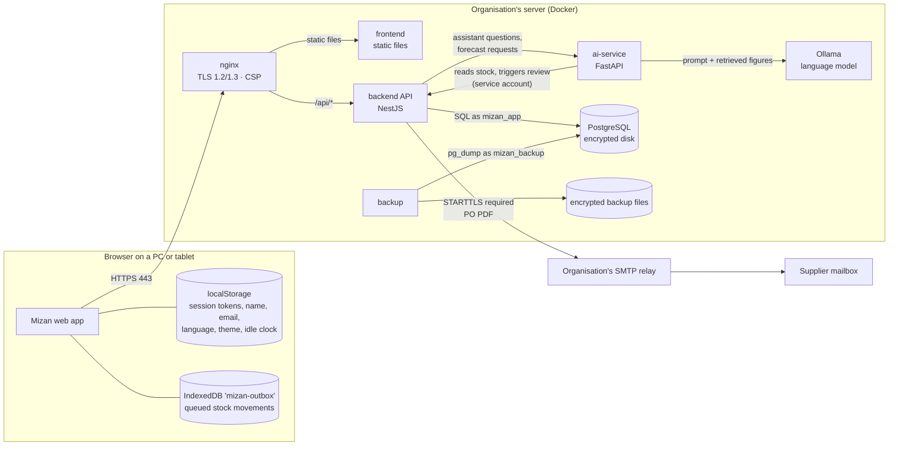

# Data flow — Mizan

> DESC evidence (CLAUDE.md §11.3). What data moves where, over what, and where it rests.
> Written from the code on 2026-10-02; update it whenever a new connection is added.
> Production layout per `docker-compose.production.yml`; development differs only as noted.

## The whole picture

Everything below runs on the organisation's own server. The one connection that leaves
the building is supplier email.

Networks (DESC #11): `public` (nginx only, ports 80/443) · `edge` (internal: nginx, frontend,
backend) · `data` (internal, **no internet**: backend, ai-service, Ollama, PostgreSQL, migrate,
backup) · `mail` (backend only, to the SMTP relay).

## Each flow

| # | From → to | What | Protection | Notes |
|---|---|---|---|---|
| 1 | Browser → nginx | Every page and API call | HTTPS, TLS 1.2+, HSTS (DESC #1); strict CSP (#13) | Development: self-signed certificate |
| 2 | nginx → frontend | Static files | Internal network `edge`, plain HTTP | Not reachable from outside |
| 3 | nginx → backend | API requests, with `X-Forwarded-For` | Internal network `edge` | Backend trusts one proxy hop (`TRUST_PROXY=1`) |
| 4 | Backend ↔ PostgreSQL | All business data | Internal network `data`; least-privilege role `mizan_app` (#19) | Disk encrypted (#2) |
| 5 | Backend → ai-service | Assistant question text and language; product id for forecasts | Internal network `data` | ai-service not routable from outside |
| 6 | ai-service → backend | Sign-in as the AI service account; reads products, stock, movements, recommendations, dashboard; triggers the 07:00 review | Internal network `data`; dedicated account `ai-service@…`, exempt from two-step only from the `data` subnet (#7) | Every request is authorised like a user's |
| 7 | ai-service → Ollama | Prompt containing the question and the figures already fetched from the backend | Internal network `data` | The model phrases data; it never sees the database. No internet |
| 8 | Backend → SMTP relay → supplier | Purchase order PDF, PO number, supplier address | STARTTLS required (`SMTP_REQUIRE_TLS`, default on); network `mail` | **The only outbound traffic** (§1) |
| 9 | backup → PostgreSQL → files | Full database dump | Read-only role `mizan_backup`; AES-256 with a key file; checksum (#17) | Copy off-site per the backup procedure |
| 10 | Browser storage | See below | Same-origin; cleared on sign-out (tokens) | On the device, not the server |

## Data at rest

| Where | What | Protection |
|---|---|---|
| PostgreSQL | Users (email, name, argon2id password hash, encrypted TOTP secret), products, locations, stock, movements, recommendations, purchase orders, suppliers (name, email, phone), sessions (hashed refresh ids), audit log (actor, action, IP, before/after) | LUKS-encrypted disk (#2); append-only rules on audit and movements (#10); app role cannot UPDATE/DELETE them (#19) |
| Backup files | Same as PostgreSQL | AES-256-CBC, PBKDF2 key, checksum; key kept off the server too (#17) |
| Browser localStorage | `mizan.auth`: access and refresh tokens plus the user's id, email, name and role; `mizan.language`, `mizan.theme`, `mizan.lastActivity`, `mizan.railCollapsed` | Same-origin only; strict CSP makes script injection very hard; tokens removed on sign-out; sessions revocable server-side (#4) |
| Browser IndexedDB `mizan-outbox` | Movements recorded offline: product, location, quantity, type, reason; display names | Kept until synced; never silently dropped (§6) |
| Ollama model folder | The language model weights | No customer data |
| Application logs (container stdout) | Request method, path, status, time, user id | Emails, IPs, tokens, passwords and query strings redacted (#15) |

## Personal data, in short

- **Staff**: email, display name, role, last sign-in, password hash, encrypted TOTP secret, sign-in
  history with IP addresses (audit log).
- **Suppliers**: business contact name, email and phone.
- **Questions to the assistant** are stored in the audit log as typed (`ASSISTANT_QUERY`), so
  staff should not type personal data into them.
- Nothing is sent to any cloud service, analytics service or external AI (DESC #18).

## Development differences (§11.2)

On the development board the services run natively, not in Docker: the AI service binds
127.0.0.1 only, Ollama is a system service, the disk is not encrypted, TLS is self-signed and
backups stay on the same disk. The flows themselves are the same.
